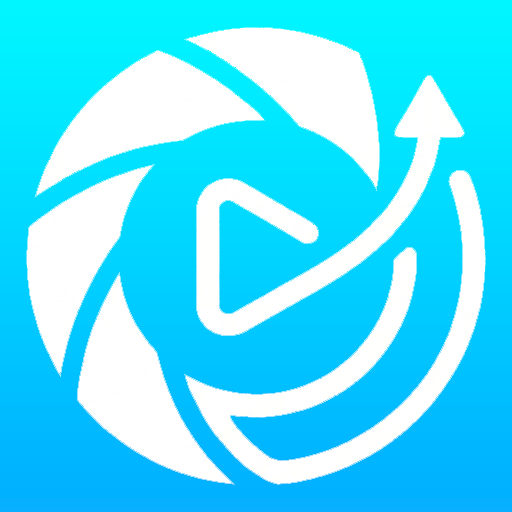
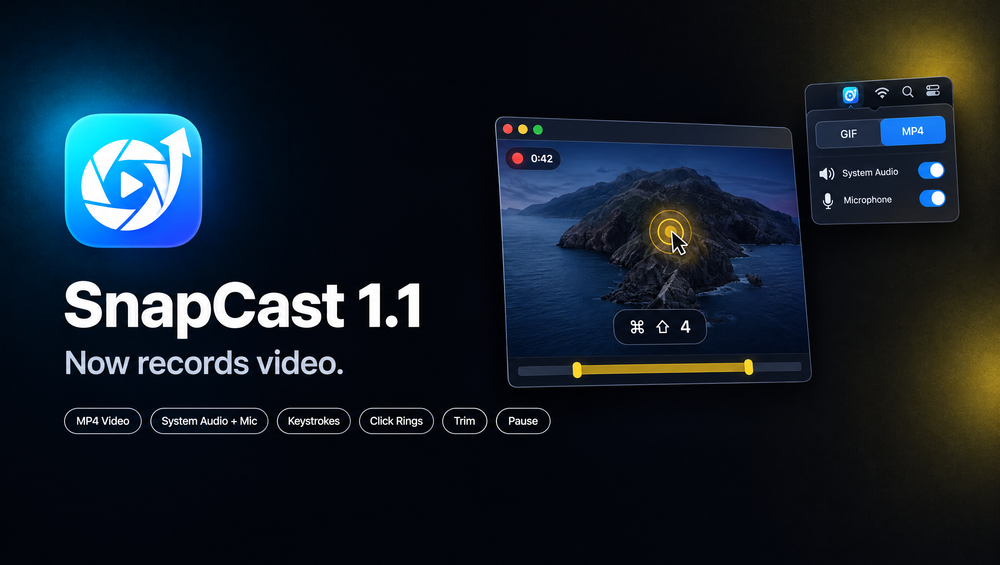

<p align="center">
  
</p>

<h1 align="center">SnapCast</h1>

<p align="center">
  A lightweight macOS menu bar app for screenshots, GIFs and screen recordings — with live annotation, keystroke overlays and a built-in editor.
</p>

<p align="center">
  
  
  
  
</p>

<p align="center">
  
</p>

---

## Features

### 🎬 Recording — GIF & MP4
- Record a **region**, a **window** or the **full screen** via ScreenCaptureKit
- **GIF** with adjustable FPS (1–60), max duration, start delay and cursor toggle
- **MP4** (H.264 or HEVC) with Low / Medium / High quality
- **System audio + microphone**, each with its own volume (0–300 %), mixed down to a single track
- **Pause / resume** mid-recording
- **Keystroke overlay** burned into the frames — handy for tutorials (supports dead keys, e.g. Czech `ě`, `š`, `č`)
- **Click rings** that visualise mouse clicks

### 📸 Screenshot
- Region, window, full screen, or **full page** (scrolling capture of a web page)
- PNG or JPEG output
- Copies to the clipboard automatically

### 🧩 Merger
- Capture several shots in a session and **stitch** them together vertically or horizontally

### ✏️ Electric Pen — live annotation
- Draw on screen *before* a screenshot or *during* a GIF recording
- Pen, highlighter, marker, line, arrow, rectangle, ellipse, eraser
- 5 colours, 3 thicknesses, undo (`⌘Z`), paint / passthrough toggle (`⌘⇧P`)
- Hold `⇧` to constrain shapes (45° lines, squares, circles)

### 🛠 Editor
- Opens after capture with a preview toast in the corner
- Crop, rotate, resize, annotate
- GIF: trim, drop frames, change speed
- MP4: trim

## Keyboard shortcuts

All shortcuts work globally and can be remapped in Settings.

| Action | Default |
|---|---|
| Record — Region | `⌘⇧6` |
| Record — Full Screen | `⌘⇧7` |
| Record — Window | `⌘⇧8` |
| Record — Region + Annotate | `⌃⇧6` |
| Screenshot — Region | `⌘⇧9` |
| Screenshot — Full Screen | `⌘⇧0` |
| Screenshot — Region + Annotate | `⌃⇧9` |
| Stop recording | `⌘⇧.` |
| Pause / resume recording | `⌘⇧,` |
| Annotation — paint / passthrough | `⌘⇧P` |
| Open editor (last capture) | `⌘⇧E` |
| Cancel | `Esc` |

Screenshot — Window, Screenshot — Full Page and Merger Session have no default binding.

## Installation

1. Download the latest `.dmg` from [Releases](https://github.com/Dahutis/NxCapture/releases).
2. Drag **SnapCast** into **Applications**.
3. Launch it — the icon appears in the menu bar (there is no Dock icon).

> [!NOTE]
> Builds are not notarized yet. If macOS says the app *"is damaged and can't be opened"*, remove the quarantine flag once:
> ```bash
> xattr -dr com.apple.quarantine /Applications/SnapCast.app
> ```

### Permissions

macOS asks for these the first time a feature needs them. You can manage them in **System Settings → Privacy & Security**.

| Permission | Needed for |
|---|---|
| Screen Recording | All captures |
| Accessibility | Global keyboard shortcuts |
| Input Monitoring | Keystroke overlay in recordings |
| Microphone | Recording with mic audio |

## Building from source

Requirements: **macOS 13+** and **Xcode 15+**. No third-party dependencies.

```bash
git clone https://github.com/Dahutis/NxCapture.git
cd NxCapture
open SnapCast.xcodeproj
```

In **Signing & Capabilities**, choose your own team, then build & run (`⌘R`).

> [!IMPORTANT]
> Sign with a real development team — not *Sign to Run Locally* (ad-hoc). With an ad-hoc signature every rebuild looks like a new app to macOS, and the Screen Recording permission prompt comes back over and over.

## Project structure

```
SnapCast/
├── App/            # Entry point, AppDelegate
├── MenuBar/        # Status item + popover UI
├── Capture/        # Session manager, screenshots, GIF frames, MP4 recorder, mic, full page, merger
├── Selection/      # Region overlay, window & display picker
├── Encoding/       # GIF encoder
├── Annotation/     # Electric Pen canvas, model, renderer, tool palette
├── KeyInput/       # Keystroke monitor & timeline, click rings, overlay compositor
├── PostProcess/    # Editor window, video trim
├── Settings/       # Persisted settings
└── Utilities/      # Shortcuts, permissions, capture toast
```

## License

[MIT](LICENSE) © 2026 Hutisaqq
